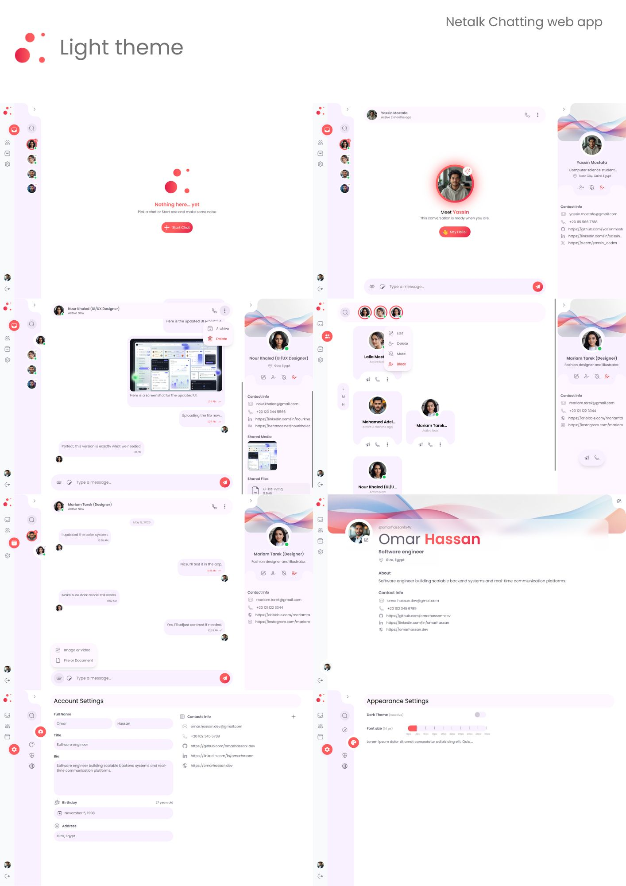
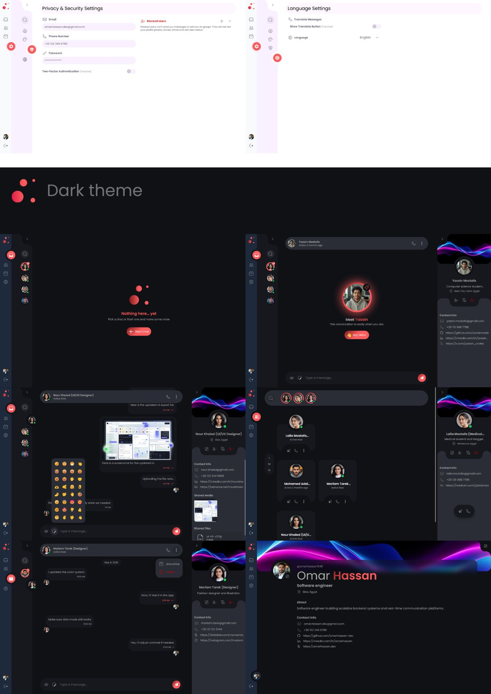
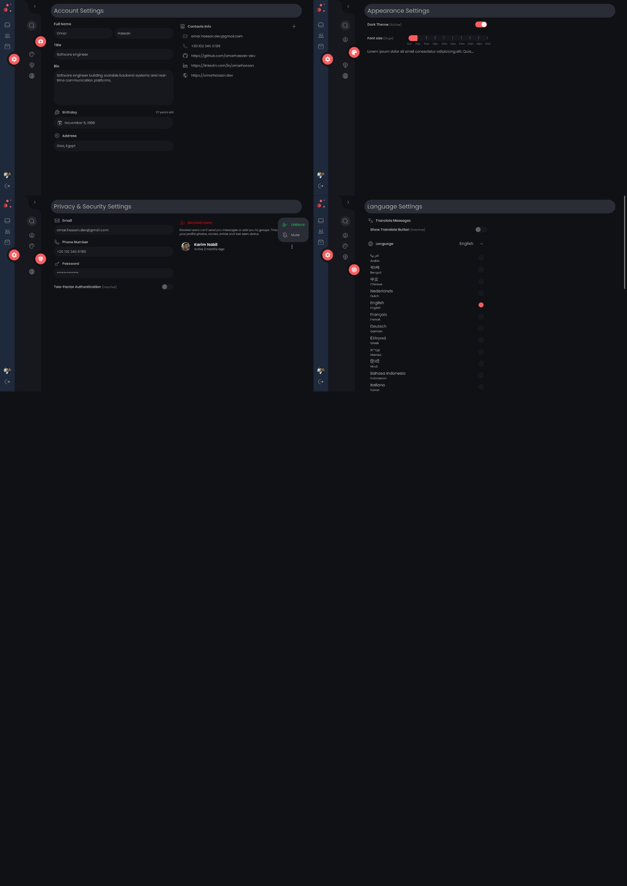

# Netalk

```bash
Current Status: Frontend Development Phase

✓ UI/UX Design Completed
✓ Responsive Layouts
✓ Component Interactions
✓ Authentication Screens
✓ User Profiles
✓ Theme Switching (Light/Dark)
✓ Mock Data Integration (JSON Files)
⏳ Login and Signup pages

⏳ Backend Development
⏳ Database Integration
⏳ GraphQL API
⏳ Authentication Services
⏳ Real-Time Messaging
⏳ Server Deployment

```

## Description

Netalk is a social networking and real-time communication platform currently under development. The project aims to provide users with a modern environment for connecting, sharing content, managing contacts, and engaging in real-time conversations.

The current version focuses exclusively on the frontend application, featuring fully designed user interfaces, responsive layouts, interactive components, authentication screens, profile management pages, user search experiences, and support for both Light and Dark themes. To simulate real-world application behavior, all displayed data is currently sourced from local JSON files.

At this stage, no backend server, database, or API integration has been implemented. All interactions are client-side demonstrations intended to showcase the application's planned user experience and design system. Development of the backend infrastructure, database integration, authentication services, GraphQL APIs, and real-time messaging capabilities is currently in progress.




